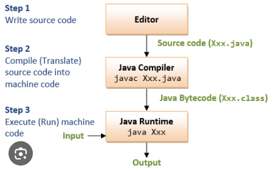

- Simple & Portable
- Object Oriented
- Independent of Host platform
- Secured and Dynamic
- High Performance - by using JIT compiler
- Robust - as it uses memory management
- Multithreaded

**Structure of Program**
```java
class HelloWorld {
    public static void main(String[] args) {
        System.out.println("Hello, World!"); 
    }
}
// compiling - javac test.java
// running - java test
```

